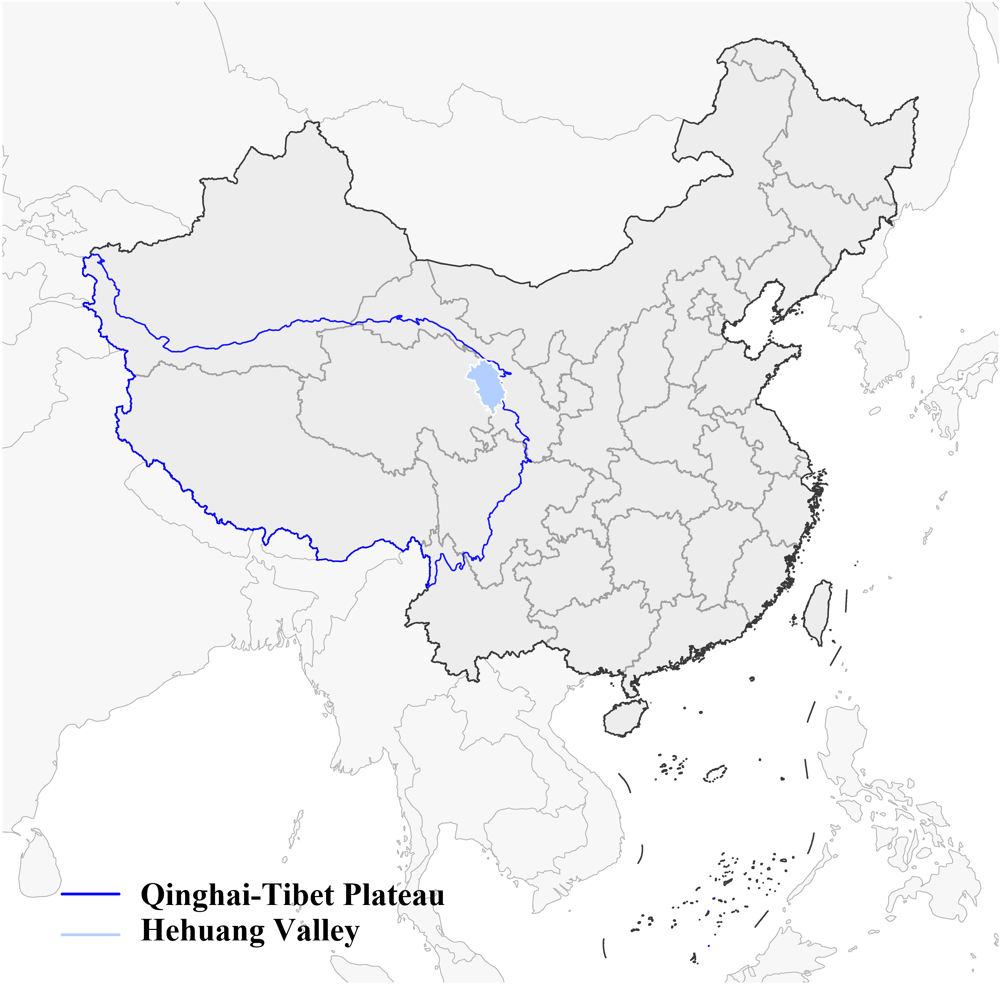
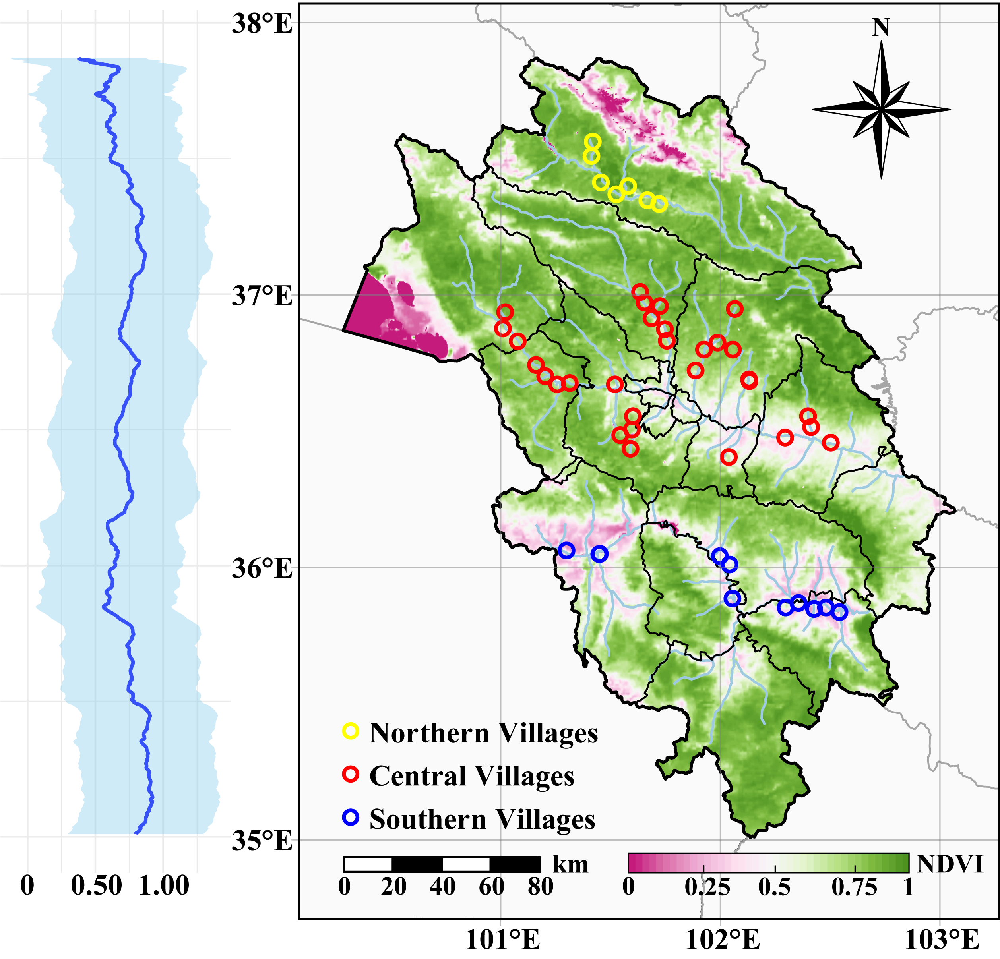
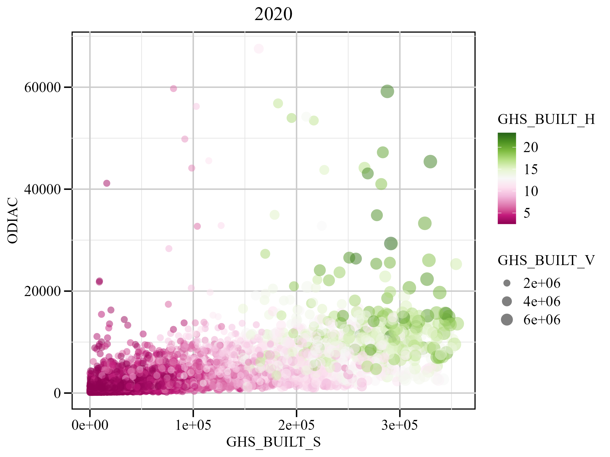
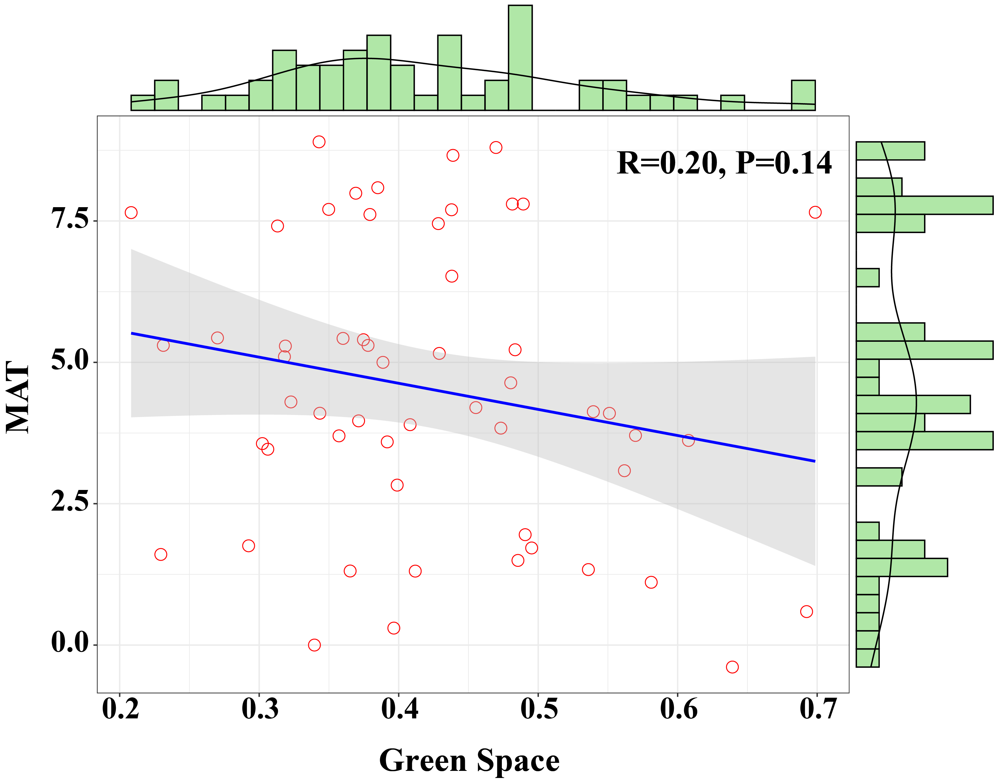
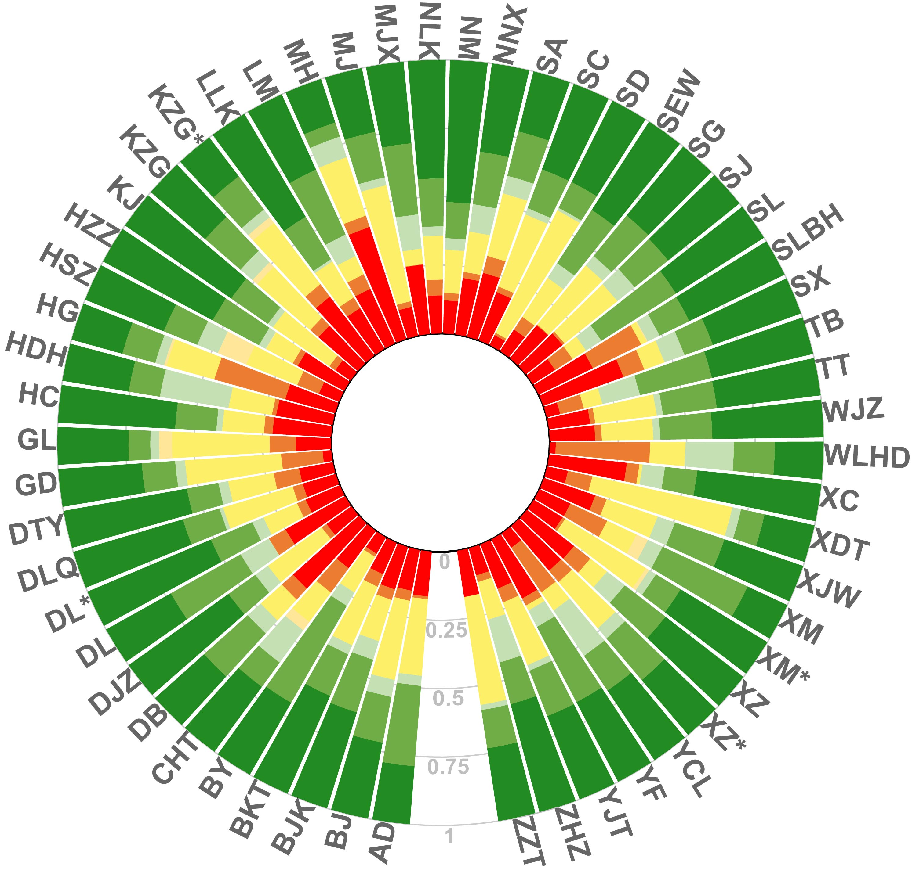
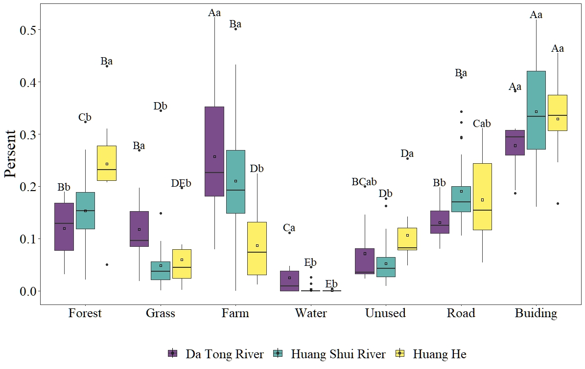
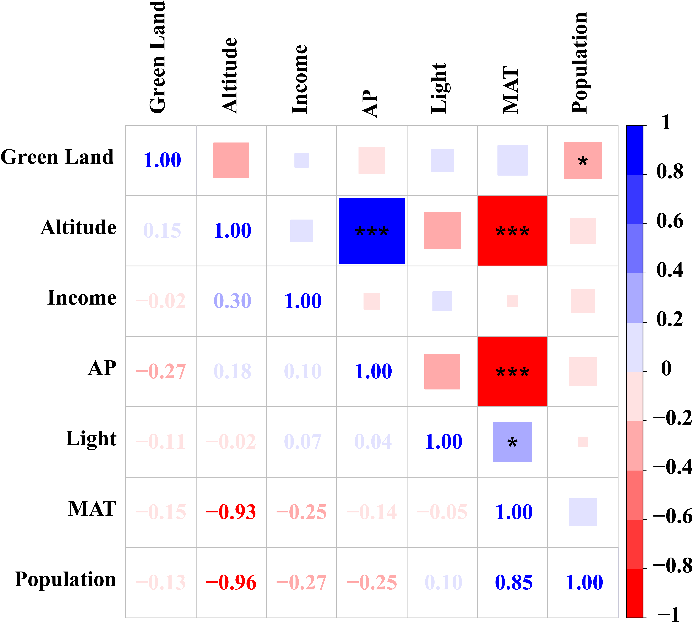
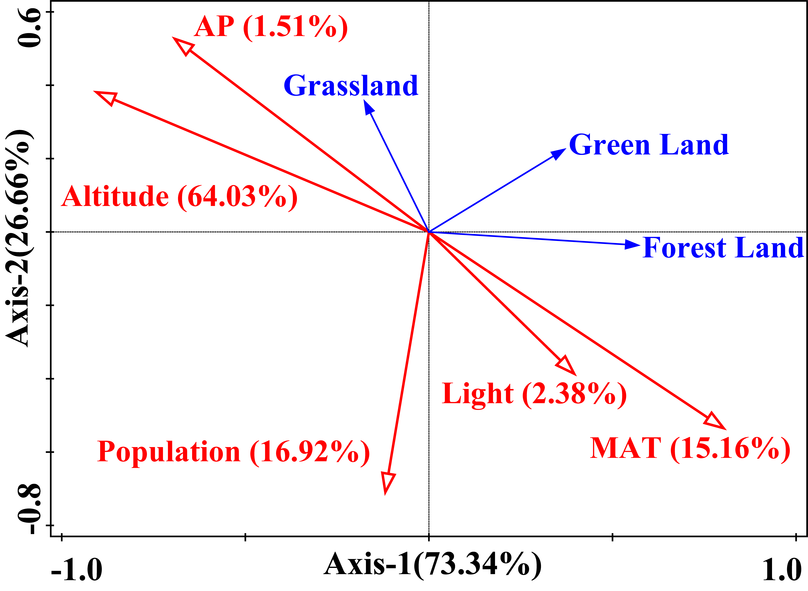

# R Visualization Scripts for Remote Sensing & Statistical Analysis
This repository collects frequently used **R scripts for data visualization** in ecological and remote-sensing studies. It includes thematic mapping, exploratory data analysis, correlation visualization, multivariate statistics, and advanced layouts commonly used in academic publications. All scripts are independent and structured with clear section headers for easy adaptation.

## Visualization Previews

| Script | Preview |
|--------|---------|
| **1-map_china.R** |  |
| **2-map_study_area.R** |  |
| **3-scatter.R** |  |
| **4-scatter_marginal_plot.R** |  |
| **5-circular_barplot.R** |  |
| **6-boxplot.R** |  |
| **7-correlation_analysis_1.R** |  |
| **7-correlation_analysis_2.R** |  |
| **8-mantel_test.R** |  |
| **9-rda_analysis.R** |  |

## Usage

### 1. Prepare Data
- Input files must match script requirements:
  - `.xlsx` tables for correlation / boxplot / Mantel / RDA
  - Spatial data (shapefiles / rasters) for mapping scripts
- Ensure variable names match the columns in your data

### 2. Run a Script
Modify file paths at the beginning of each `.R` file:

### 3. Export Outputs
- Each script automatically exports publication-ready figures in: PNG / JPEG / PDF

## Applications
- Map production  
- Statistics figure production

## Author
Xiaoyu Li, 2025  

## Contact
If you are interested in collaboration or research discussion:  
Email: *xiaoyu6936@gmail.com*  
Personal Website: *https://xiaoyu0618.github.io/*  
